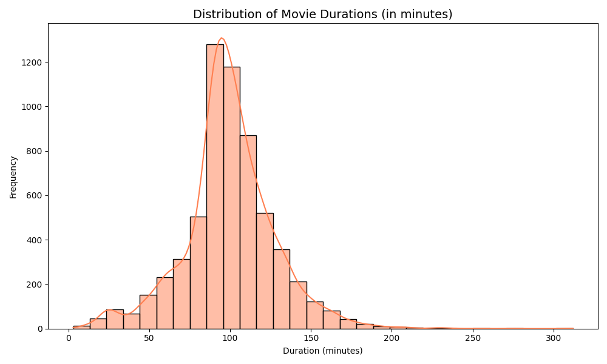
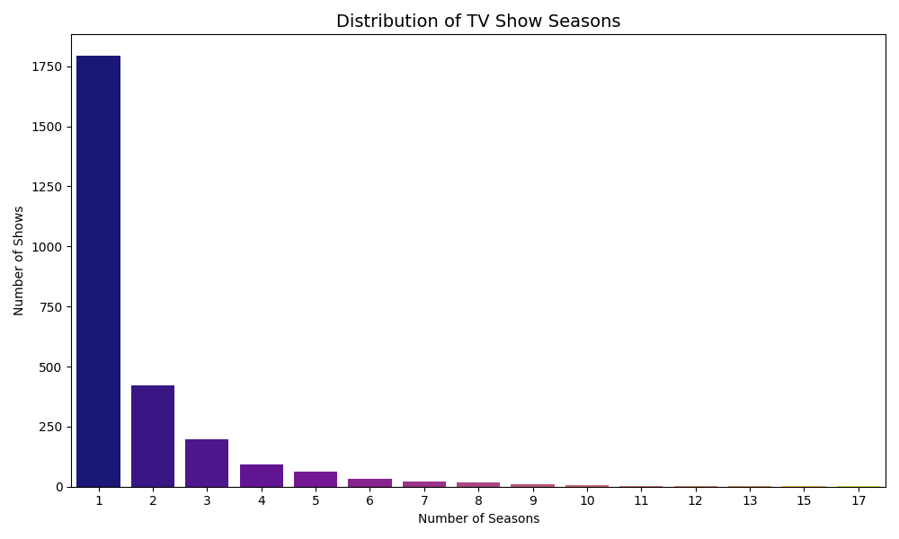

# 📊 Netflix Viewer Pattern Analytics

A data analytics project that uncovers trends and patterns in Netflix’s content library using **Exploratory Data Analysis (EDA)** and visualization techniques.

This project highlights how Netflix structures its content to align with modern viewing behavior.

---

## 🔍 Project Overview

This project analyzes the Netflix dataset to explore:

- Growth of content over time 📈  
- Distribution of Movies vs TV Shows 🎬📺  
- Movie duration trends  
- TV show season patterns  
- Genre and country-wise distribution 🌍  

The goal is to extract **data-driven insights** into Netflix’s content strategy.

---

## 🛠️ Tech Stack

- Python 🐍  
- Pandas  
- NumPy  
- Matplotlib  
- Seaborn  
- Jupyter Notebook  

---

## 📦 Dataset

- Source: Netflix Movies & TV Shows Dataset (Kaggle)  
- Size: ~6,000+ entries  
- Features include: Title, Type, Genre, Country, Duration, Rating, Date Added  

---

## 📊 Key Visualizations

### 🎬 Movie Duration Distribution

---

### 📺 TV Show Season Distribution

---

## 📊 Key Insights

### 🎬 Movie Duration
- Most movies fall within **90–100 minutes**
- Distribution is **right-skewed**, with very few long-duration movies
- Suggests preference for **standardized, binge-friendly content**

---

### 📺 TV Show Seasons
- Majority of shows have **1–2 seasons**
- Very few exceed **5 seasons**
- Indicates focus on **limited series format**

---

### 🌍 Content Distribution
- The **United States** leads in content production  
- Followed by **India** and the **UK**  
- Reflects Netflix’s global expansion strategy  

---

### 🎭 Genre Trends
- Popular genres include:
  - Dramas  
  - Comedies  
  - Documentaries  
- Indicates strong preference for **mainstream, high-engagement content**

---

### 📌 Overall Conclusion
Netflix prioritizes **short, binge-worthy content**, with:
- Movies under ~2 hours  
- TV shows with limited seasons  

This aligns with modern viewer behavior and platform engagement strategies.

---

## 📁 Project Structure

netflix-eda/
│
├── Data/
│ └── netflix_titles.csv
│
├── Notebooks/
│ └── Netflix_EDA.ipynb
│
├── images/
│ └── (plots)
│
├── README.md
└── requirements.txt

